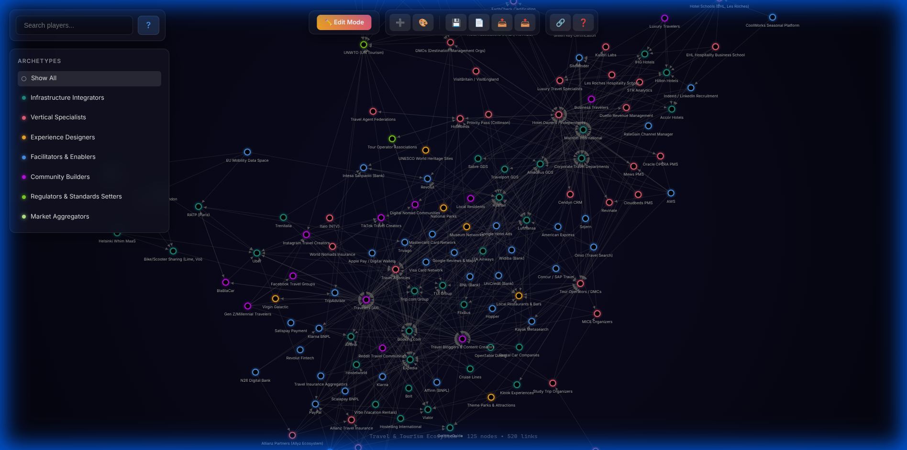
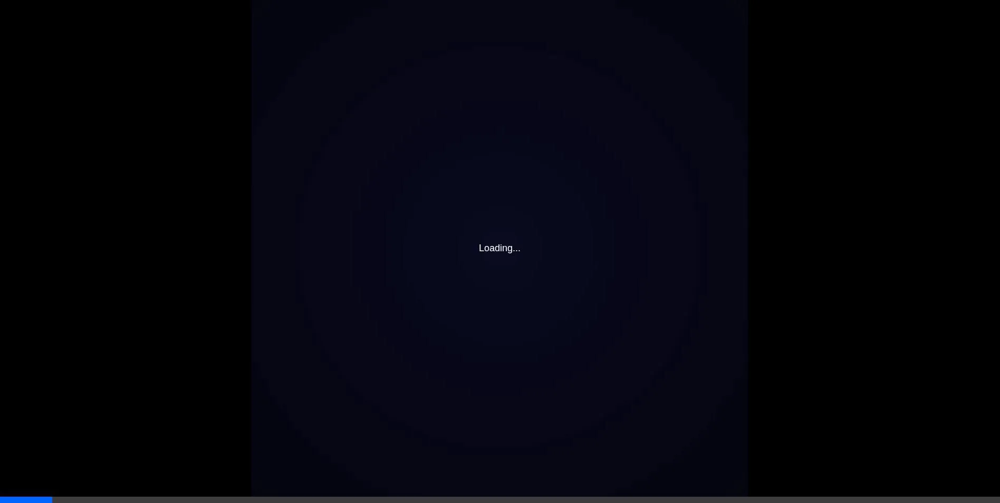
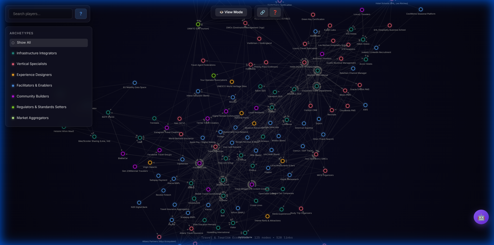

# 🌐 Graph Creator - Interactive Network Visualization Tool



> Create, customize, and share beautiful interactive graphs for any domain. Transform complex relationships into stunning visual networks.

## 🎬 See It In Action



*Watch the full demo: Mode switching, node creation, and graph editing in action!*

### AI-Powered Graph Analysis



*Ask natural language questions and get intelligent insights about your graph using Gemini AI!*

## ✨ Features

### 🎨 Visual Graph Editor
*   **Dual Mode System**: Toggle between View Mode (explore) and Edit Mode (create & modify)
*   **Drag-and-Drop Nodes**: Intuitive force-directed physics simulation
*   **Custom Archetypes**: Define categories with unique colors and descriptions
*   **Rich Node Data**: Add names, descriptions, market sizes, and business models

### 🤖 AI-Powered Insights
*   **Gemini Integration**: Ask natural language questions about your graph
*   **Smart Analysis**: Get insights about node relationships, patterns, and structure
*   **Contextual Answers**: AI understands your graph's archetypes, connections, and metadata
*   **Suggested Questions**: Quick-start prompts to explore your graph
*   **Secure**: API key stored locally in browser, never sent to our servers

### 🔗 Smart Connections
*   **Connect Mode (🔗)**: Dedicated toolbar button for easy linking
*   **Shift+Click**: Quick keyboard shortcut for power users
*   **Right-Click Menus**: Quick access to edit and delete options
*   **Visual Feedback**: Gold highlights show connection creation in progress

### 💾 Data Management
*   **Saved Graphs (📂)**: Manage multiple named graphs locally
*   **Auto-Save**: Never lose work - changes persist automatically
*   **JSON Import/Export**: Back up and share as JSON files
*   **URL Sharing**: Entire graph encoded in sharable links with QR codes
*   **No Backend Required**: Works completely offline

### 🎓 User-Friendly
*   **Interactive Tutorial**: Step-by-step guide for new users
*   **Real-Time Notifications**: Success/error feedback for all actions
*   **Search & Filter**: Find nodes instantly by name or archetype
*   **Help Modal**: Quick reference for all features

### 🎯 Use Cases
*   Business Ecosystems & Value Chains
*   Social Networks & Relationship Mapping
*   Knowledge Graphs & Concept Maps
*   Project Dependencies & Workflows
*   Organizational Charts & Team Structures

## 🚀 Getting Started

### Prerequisites
*   Node.js 16+ and npm

### Installation

1.  **Clone the repository**
    ```bash
    git clone https://github.com/yourusername/graph-creator.git
    cd graph-creator
    ```

2.  **Install dependencies**
    ```bash
    npm install
    ```

3.  **Run locally**
    ```bash
    npm run dev
    ```
    Open `http://localhost:5173` in your browser.

4.  **Build for production**
    ```bash
    npm run build
    ```

## 📖 How to Use

> **📘 Complete User Guide:** For detailed step-by-step instructions, see [USER_GUIDE.md](USER_GUIDE.md)
> 
> **Includes:**
> - How to create, edit, and delete nodes (with screenshots)
> - How to connect nodes (Shift+Click explained)
> - JSON import/export format and examples
> - AI assistant usage guide
> - Troubleshooting common issues

### Quick Start

### Creating Your First Graph

1.  **Start Fresh**: Click 🆕 "New Graph" button, name your graph, and start with a clean slate.
2.  **Toggle Edit Mode**: Click the mode toggle button at the top
3.  **Add Nodes**: Click ➕ button and fill in node details
4.  **Create Connections**: 
    - **Option A**: Click **Connect Mode** (🔗), then click two nodes.
    - **Option B**: Hold **Shift**, click first node, then second node.
    - Connection arrow appears!
5.  **Customize Archetypes**: Click 🎨 to create custom categories with colors
6.  **Save Your Work**:
    -   💾 "Save to Browser" - Saves to localStorage (automatic)
    -   📂 "Saved Graphs" - View and manage all your saved graphs
    -   📤 "Save as JSON File" - Downloads a `.json` backup file
7.  **Share**: Click 🔗 to generate a shareable link with QR code

### Editing & Deleting

**Edit a Node:**
- Right-click the node → Select "✏️ Edit Node"
- Or: Click Tutorial button (❓) for visual guide

**Delete a Node:**
- Right-click the node → Select "🗑️ Delete Node"

*   **Connect Nodes:** Toggle **Connect Mode** (🔗) OR Hold `Shift`, then click two nodes sequentially to link them.
**Delete a Connection:**
- Right-click directly on the connection line → Confirm deletion

### JSON Import/Export

**Export (📤):**
- Click the export button to download your graph as JSON
- Use this for backups or sharing files

**Import (📥):**
- Click the import button to see **JSON format documentation**
- Download the template: `graph-template.json`
- Modify it with your data
- Format includes:
  ```json
  {
    "name": "Graph Name",
    "nodes": [{id, name, archetype, outbound, inbound, ...}],
    "links": [{source, target, type}],
    "archetypes": [{id, name, color, description}]
  }
  ```
- Full example in the modal that appears when you click 📥

### Working with Multiple Graphs

*   **Create New Graph**: Click 🆕 - Prompts for a name and saves current work
*   **Saved Graphs**: Click 📂 - Load previous graphs or delete old ones
*   **Save Progress**: Click 💾 - Saves to browser localStorage
*   **Export Backup**: Click 📤 - Downloads JSON file to your computer
*   **Load from URL**: Share links contain the entire graph - just open the link!
*   **Browser Storage**: All saved graphs persist in localStorage

### Using the AI Assistant

1.  **Get API Key**: Visit [Google AI Studio](https://makersuite.google.com/app/apikey) to get a free Gemini API key
2.  **Open AI Chat**: Click the 🤖 floating button in the bottom right
3.  **Enter API Key**: Paste your key (stored securely in your browser)
4.  **Ask Questions**: Try these examples:
    -   "What are the main hubs in this graph?"
    -   "Which nodes have the most connections?"
    -   "Explain the different archetypes"
    -   "What insights can you provide about this ecosystem?"
5.  **Get Insights**: The AI analyzes your graph structure, connections, and metadata

> **Note**: Your API key is stored locally in browser localStorage and never sent to our servers. Each request goes directly from your browser to Google's Gemini API.

### Keyboard Shortcuts
*   `Shift + Click`: Create connection between nodes
*   `Right Click`: Open context menu (Edit Mode only)

### Tips
*   **Auto-Save**: Graphs automatically save when you make changes
*   **URL Sharing**: The entire graph is compressed and encoded in the URL - no server needed!
*   **Mobile Friendly**: Works great on tablets and phones with touch support

## 🛠️ Tech Stack

*   **Frontend**: React 18 + TypeScript
*   **Visualization**: D3.js v7
*   **Build Tool**: Vite
*   **State Management**: Custom React hooks
*   **Styling**: CSS Modules with Glassmorphism
*   **Compression**: Pako (gzip)
*   **QR Codes**: qrcode library

## 📁 Project Structure

```
src/
├── components/
│   ├── Editor/          # Editor-specific components
│   │   ├── EditorToolbar.tsx
│   │   ├── NodeForm.tsx
│   │   ├── ArchetypeManager.tsx
│   │   ├── SavedGraphsModal.tsx
│   │   ├── NewGraphModal.tsx
│   │   └── ShareModal.tsx
│   ├── Graph.tsx        # Main D3 visualization
│   ├── InfoPanel.tsx    # Node details panel
│   ├── Controls.tsx     # Search & filters
│   └── Tutorial.tsx     # User onboarding
├── hooks/
│   └── useGraphEditor.ts  # State management
├── utils/
│   ├── graphStorage.ts    # LocalStorage utilities
│   └── shareUtils.ts      # URL encoding/decoding
├── types/
│   └── graph.ts           # TypeScript definitions
└── App.tsx               # Main application
```

## 🎨 Design Philosophy

This tool prioritizes **visual excellence** and **user experience**:
*   **Dark Mode First**: Designed for modern OLED screens
*   **Glassmorphism**: Premium frosted-glass UI panels
*   **Neon Glow Effects**: D3 filters create stunning node halos
*   **Smooth Animations**: Micro-interactions enhance engagement
*   **Responsive**: Adapts beautifully to all screen sizes

## 🤝 Contributing

Contributions are welcome! Please feel free to submit a Pull Request.

### Development Workflow
1.  Fork the repository
2.  Create a feature branch (`git checkout -b feature/AmazingFeature`)
3.  Commit your changes (`git commit -m 'Add some AmazingFeature'`)
4.  Push to the branch (`git push origin feature/AmazingFeature`)
5.  Open a Pull Request

## 📄 License

This project is licensed under the MIT License - see the [LICENSE](LICENSE) file for details.

## 📖 For Beginners

**New to web development?** Check out our comprehensive [Beginner's Guide](BEGINNERS_GUIDE.md) that explains:
- How this application was built from scratch
- The logic behind each feature
- Technology stack explained in simple terms  
- Step-by-step code walkthrough
- Tips and resources to learn more

Perfect for students and aspiring developers! 🎓

## 🙏 Acknowledgments

*   Built with ❤️ using React and D3.js
*   AI powered by Google Gemini
*   Inspired by network graph tools and knowledge management systems
*   Travel & Tourism Ecosystem template included as example

## 📞 Support

*   📧 Email: your-email@example.com
*   🐛 Issues: [GitHub Issues](https://github.com/yourusername/graph-creator/issues)
*   📚 Docs: See `DEPLOYMENT.md` for hosting guide and `BEGINNERS_GUIDE.md` for learning resources

---

**Made with 💫 by [Your Name]** • [Website](https://yourwebsite.com) • [Twitter](https://twitter.com/yourusername)
